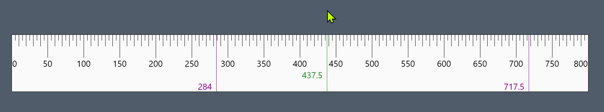
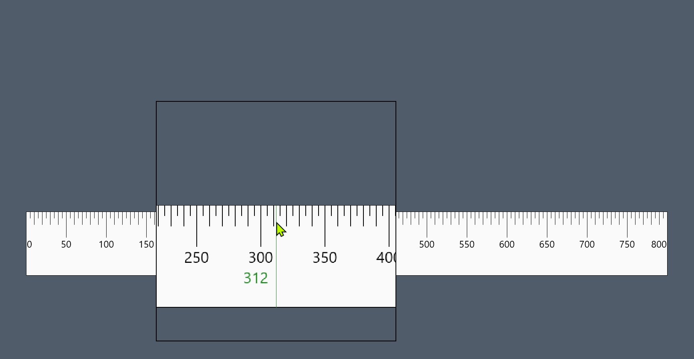
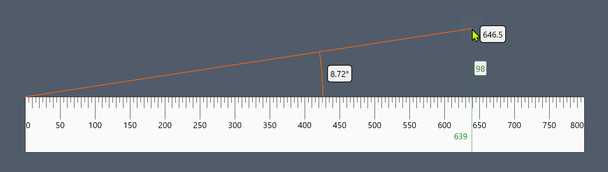
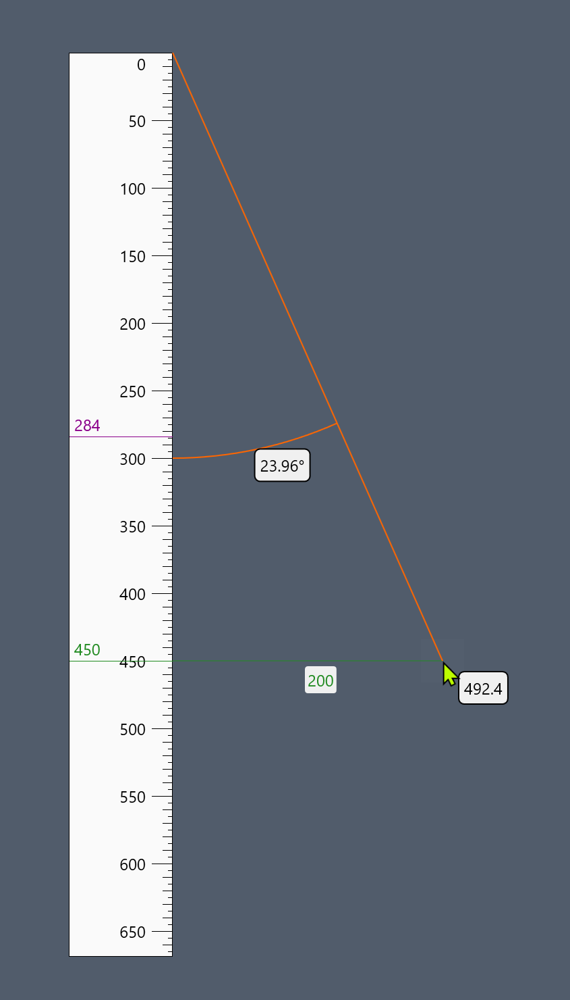

# Ruler
A Windows screen ruler with angle measurement and magnifier.

- Show angle measurements
- Integrated adjustable magnifier
- Track cursor postion anywhere on screen
- Set markers
- Supports per-monitor high DPI screen resolution
- Change units:
  - Pixel
  - DIP (device independent pixel)
  - Point
  - Centimeter
  - Inch
  - Percent of screen size
- Horizontal or Vertical orientation 
- Change the zero point
- Change the scale side
- Dock the ruler to screen edges
- Change color themes
- Make fine adjustments to ruler position and length and mouse position from the keyboard

User configuration is saved using [Config.Net](https://github.com/aloneguid/config).

Angle measure shows angle, hypotenuse, horizontal and verical offsets 

